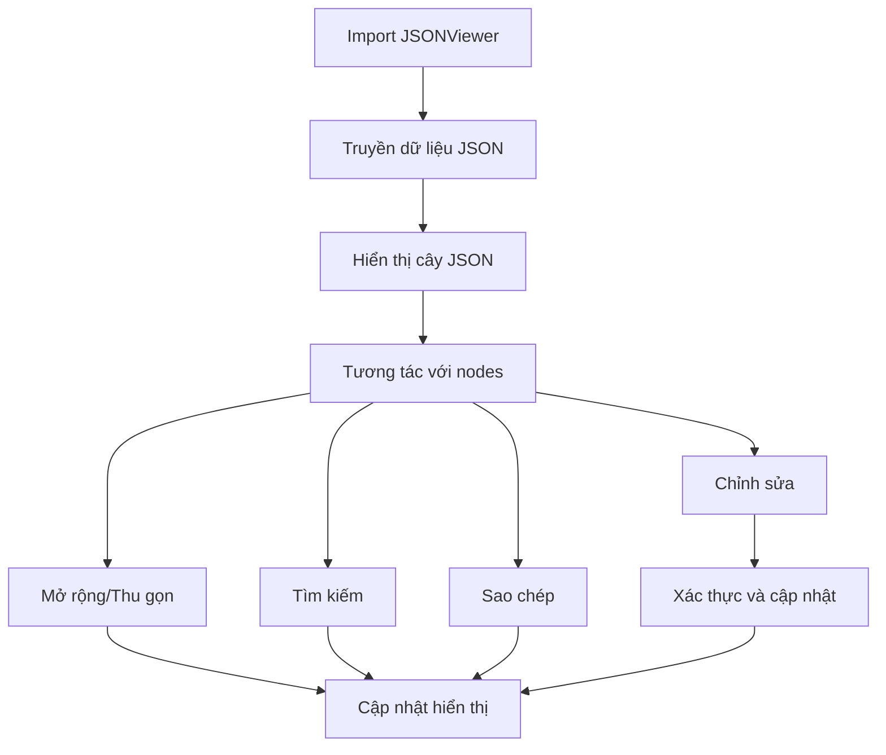

# JSON Viewer for React - Tài liệu Yêu cầu Sản phẩm

## 1. Tổng quan Sản phẩm
JSON Viewer for React là một thư viện React nhỏ gọn, nhẹ phụ thuộc, hiển thị dữ liệu JSON dưới dạng cây tương tác với các tính năng mở rộng/thu gọn, tìm kiếm/đánh dấu, sao chép và chỉnh sửa trực tuyến tùy chọn. Được thiết kế như một React component để tích hợp dễ dàng.

- Thư viện tập trung vào tính chính xác, trải nghiệm phát triển, hỗ trợ TypeScript, khả năng truy cập và kích thước bundle nhỏ.
- Mục tiêu thị trường: Các nhà phát triển React cần hiển thị và chỉnh sửa dữ liệu JSON một cách trực quan và tương tác.

## 2. Tính năng Cốt lõi

### 2.1 Vai trò Người dùng
Không cần phân biệt vai trò người dùng - thư viện được thiết kế cho các nhà phát triển sử dụng trong ứng dụng React của họ.

### 2.2 Module Tính năng
Thư viện JSON Viewer for React bao gồm các trang/module chính sau:

1. **JSONViewer Component**: Component chính hiển thị cây JSON với các tính năng tương tác cơ bản.
2. **TreeNode Component**: Component đệ quy hiển thị từng node trong cây JSON.
3. **Controls Component**: Thanh điều khiển với các nút mở rộng/thu gọn tất cả và tìm kiếm.
4. **InlineEditor Component**: Trình chỉnh sửa nhỏ có thể tái sử dụng với xác thực.

### 2.3 Chi tiết Trang

| Tên Trang | Tên Module | Mô tả Tính năng |
|-----------|------------|-----------------|
| JSONViewer Component | Hiển thị cây JSON | Hiển thị dữ liệu JSON dưới dạng cây có thể mở rộng/thu gọn, hỗ trợ tìm kiếm, sao chép và chỉnh sửa |
| TreeNode Component | Node cây đệ quy | Hiển thị từng node với key, value, type badge và các hành động (sao chép, chỉnh sửa) |
| Controls Component | Thanh điều khiển | Cung cấp nút mở rộng/thu gọn tất cả, ô tìm kiếm với highlight kết quả |
| InlineEditor Component | Chỉnh sửa trực tuyến | Cho phép chỉnh sửa giá trị trực tiếp với xác thực và xử lý lỗi |

## 3. Quy trình Cốt lõi

**Quy trình Người dùng Chính:**
1. Nhà phát triển import và sử dụng JSONViewer component trong ứng dụng React
2. Truyền dữ liệu JSON vào prop `data`
3. Người dùng cuối có thể:
   - Click vào key để mở rộng/thu gọn object/array
   - Sử dụng thanh tìm kiếm để lọc và highlight các node
   - Sao chép giá trị hoặc đường dẫn của node
   - Chỉnh sửa giá trị trực tiếp (nếu được bật)
   - Sử dụng các nút điều khiển để mở rộng/thu gọn tất cả

## 4. Thiết kế Giao diện Người dùng

### 4.1 Phong cách Thiết kế
- **Màu sắc chính**: CSS variables với theme sáng/tối
  - Light theme: `--jv-bg-color: #ffffff`, `--jv-text-color: #333333`
  - Dark theme: `--jv-bg-color: #1a1a1a`, `--jv-text-color: #ffffff`
- **Phong cách nút**: Rounded corners với hover effects
- **Font**: Monospace cho values, sans-serif cho keys và UI
- **Phong cách layout**: Card-based với indentation cho hierarchy
- **Icons**: Sử dụng Unicode symbols hoặc CSS-based icons để tránh dependencies

### 4.2 Tổng quan Thiết kế Trang

| Tên Trang | Tên Module | Các phần tử UI |
|-----------|------------|----------------|
| JSONViewer | Container chính | Background trắng/đen, border radius 8px, padding 16px, font-family monospace |
| TreeNode | Node item | Indentation theo depth, type badges với màu sắc khác nhau, hover effects |
| Controls | Thanh điều khiển | Sticky header với search input, action buttons, flexbox layout |
| InlineEditor | Input chỉnh sửa | Inline input với border highlight, validation error styling |

### 4.3 Responsive
Thiết kế desktop-first với mobile-adaptive:
- Breakpoint tại 768px cho mobile
- Touch-friendly button sizes (min 44px)
- Horizontal scroll cho deep nesting trên mobile
- Optimized keyboard navigation cho accessibility