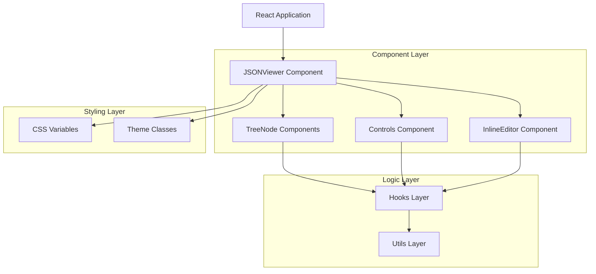
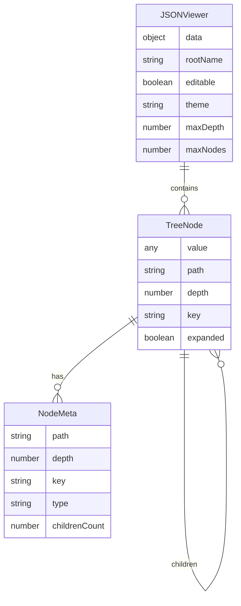

# JSON Viewer for React - Tài liệu Kiến trúc Kỹ thuật

## 1. Thiết kế Kiến trúc



## 2. Mô tả Công nghệ
- **Frontend**: React@18 + TypeScript@5 + Rollup (build tool)
- **Styling**: Pure CSS với CSS Variables, không sử dụng framework UI
- **Testing**: Jest + React Testing Library
- **Backend**: Không có (thư viện frontend thuần túy)

## 3. Định nghĩa Route
Không áp dụng - đây là thư viện component, không phải ứng dụng standalone.

## 4. Định nghĩa API

### 4.1 Core Component API

**JSONViewer Component Props**
```typescript
interface JSONViewerProps {
  data: object | string;
  rootName?: string;
  collapsed?: boolean | number;
  editable?: boolean;
  search?: string;
  onSearchMatchCount?: (count: number) => void;
  showTypes?: boolean;
  theme?: 'light' | 'dark' | string;
  maxRenderDepth?: number;
  maxNodes?: number;
  renderValue?: (value: any, path: string) => ReactNode;
  renderKey?: (key: string, path: string) => ReactNode;
  className?: string;
  style?: React.CSSProperties;
  onSelect?: (path: string, node: NodeMeta) => void;
  onChange?: (path: string, oldVal: any, newVal: any) => void;
  onError?: (err: Error) => void;
}
```

**JSONViewerHandle (Imperative API)**
```typescript
interface JSONViewerHandle {
  expandAll(): void;
  collapseAll(): void;
  search(query: string): void;
  get(path: string): any;
  set(path: string, value: any): void;
  toJSON(): object;
}
```

### 4.2 Hook APIs

**useExpandedPaths Hook**
```typescript
function useExpandedPaths(initialCollapsed?: boolean | number): {
  expandedPaths: Set<string>;
  togglePath: (path: string) => void;
  expandAll: () => void;
  collapseAll: () => void;
  isExpanded: (path: string) => boolean;
}
```

**useSearch Hook**
```typescript
function useSearch(data: any, searchQuery: string): {
  matchedPaths: Set<string>;
  matchCount: number;
  shouldHighlight: (path: string, value: any) => boolean;
}
```

### 4.3 Utility APIs

**Path Utils**
```typescript
function buildPath(parentPath: string, key: string | number): string;
function getValueByPath(data: any, path: string): any;
function setValueByPath(data: any, path: string, value: any): any;
function parsePath(path: string): Array<string | number>;
```

**Safe Parse Utils**
```typescript
function safeParse(value: string): {
  success: boolean;
  data?: any;
  error?: string;
}
```

## 5. Kiến trúc Server
Không áp dụng - thư viện frontend thuần túy.

## 6. Mô hình Dữ liệu

### 6.1 Định nghĩa Mô hình Dữ liệu



### 6.2 TypeScript Type Definitions

**Core Types**
```typescript
// Node metadata interface
interface NodeMeta {
  path: string; // 'root.foo[0].bar'
  depth: number;
  key: string | number;
  type: 'object' | 'array' | 'string' | 'number' | 'boolean' | 'null';
  childrenCount?: number;
}

// JSON path type
type JSONPath = string;

// Theme configuration
type Theme = 'light' | 'dark' | string;

// Value types
type JSONValue = string | number | boolean | null | JSONObject | JSONArray;
interface JSONObject {
  [key: string]: JSONValue;
}
interface JSONArray extends Array<JSONValue> {}

// Render options for custom renderers
interface RenderOptions {
  path: string;
  depth: number;
  expanded: boolean;
  editable: boolean;
}

// Search result interface
interface SearchResult {
  path: string;
  matchType: 'key' | 'value';
  matchText: string;
}

// Edit state interface
interface EditState {
  path: string;
  originalValue: any;
  currentValue: string;
  isValid: boolean;
  error?: string;
}

// Component state interfaces
interface ViewerState {
  expandedPaths: Set<string>;
  searchQuery: string;
  editStates: Map<string, EditState>;
  data: any;
}
```

**Event Handler Types**
```typescript
type SelectHandler = (path: string, node: NodeMeta) => void;
type ChangeHandler = (path: string, oldValue: any, newValue: any) => void;
type ErrorHandler = (error: Error) => void;
type SearchMatchHandler = (count: number) => void;
```

**Configuration Types**
```typescript
interface ViewerConfig {
  maxRenderDepth: number; // default: 6
  maxNodes: number; // default: 2000
  defaultCollapsed: boolean | number; // default: false
  enableKeyboardNavigation: boolean; // default: true
  enableCopy: boolean; // default: true
  copyFormat: 'json' | 'value' | 'path'; // default: 'value'
}
```